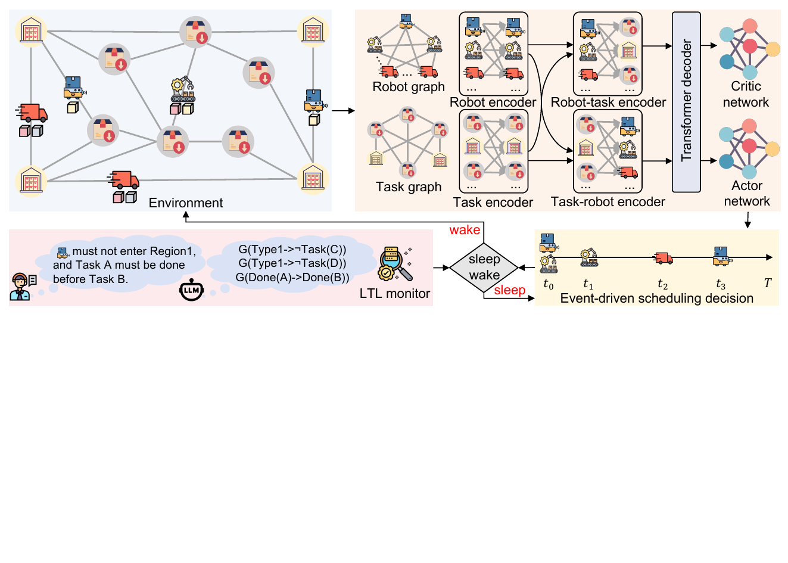

# ALIS-WC

> **Asynchronous Logic-Induced Sleep-Wake Coordination**
> for Heterogeneous Multi-Robot Scheduling under Linear Temporal Logic Constraints
>
> Accepted at RSS 2026



## Status

- [x] Paper accepted at RSS 2026
- [x] Method overview and training metrics dashboard
- [ ] Code release (in preparation)
- [ ] Pretrained checkpoints (in preparation)
- [ ] Benchmark suite (in preparation)

## Training Metrics

Live training metrics and per-seed raw curves are available on SwanLab:

🔗 **<https://swanlab.cn/@Monnaloo/ALIS-WC>**

The dashboard contains the two ablation conditions reported in the paper (Fig. 6):

- **ALIS-WC** — RL with progress-based potential shaping (our main method)
- **RL w/o shaping** — sparse-reward baseline

In addition to the makespan and sparse-return curves shown in the paper, the dashboard exposes raw per-seed runs and additional training-time diagnostics.

## Citation

```bibtex
@inproceedings{li2026aliswc,
  author    = {Xuyang Li and Leilei Li and Jianwu Fang and Boyuan Chen and Jianru Xue},
  title     = {Event-Driven Sleep-Wake Scheduling for Heterogeneous Robots under {LTL} Constraints},
  booktitle = {Robotics: Science and Systems (RSS)},
  year      = {2026}
}
```

(Final BibTeX will be updated after camera-ready DOI is assigned.)

## Coming Soon

The full source code (event-driven simulator, LTL shield, sleep-wake layer, PPO training scripts, baseline implementations, NL-to-LTL translator, and benchmark generation scripts) along with pretrained model checkpoints will be released here shortly.

## License

This project is released under the MIT License. See [LICENSE](LICENSE) for details.
